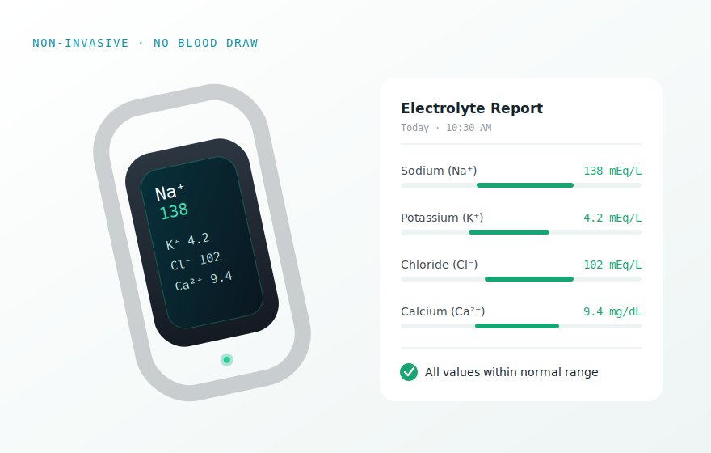

# HARAI Healthcare — website

A single-page site for **HARAI Healthcare** — light clinical theme, green pinwheel-cross
brand, navy + teal accents, tagline *"Innovating Diagnostics. Enhancing Lives."*,
domain `haraihealthcare.com`. It's presented as a portfolio of **independent projects**
(deliberately *not* one merged platform):

1. **Non-invasive electrolyte sensing** — wearable, no blood pricking
2. **Medical imaging AI** — disease prediction & tumor segmentation (CT / MRI / X-ray)
3. **Cardiac intelligence** — ECG
4. **Neuro signals** — EEG (seizure prediction, Alzheimer's markers)
5. **EHR platform** — standalone app

No build step, no dependencies, no server — just `index.html` and an `images/` folder.

```
harai/
├─ index.html
├─ README.md
├─ .nojekyll
└─ images/
   ├─ hero.svg
   ├─ electrolyte.svg
   ├─ imaging.svg
   ├─ cardiac.svg
   ├─ neuro.svg
   └─ ehr.svg
```

## About the images (please read)

The images in `images/` are **hand-built medical illustrations (SVG)** acting as
**placeholders**. They look intentional and on-brand, but they are not photographs.
Swap in your real product photos / study renders / app screenshots whenever you have them.

**To replace an image:** drop your file into `images/` and point the project's ``
at it in `index.html`. For example, for the electrolyte project:

```html
<!-- find this line in index.html -->
<div class="pcard-media"></div>
<!-- change it to your photo -->
<div class="pcard-media"></div>
```

The image area is a fixed-ratio frame (object-fit: cover), so any landscape-ish
photo (roughly 3:2 or 16:10) will crop in cleanly. Keep files small (< ~500 KB each).

> WARNING: The illustrations are demonstration assets, not clinical output. This is NOT a
> medical device and the visuals are NOT for diagnosis. The footer carries a matching
> disclaimer — keep something like it if you publish.

## Deploy to GitHub Pages

### Through the website (no command line)
1. Create a repo, e.g. `harai-site`.
2. Add file -> Upload files — drag in `index.html`, `README.md`, `.nojekyll`, and the
   whole `images/` folder. Commit.
3. Settings -> Pages -> Build and deployment -> Source -> Deploy from a branch.
4. Branch `main`, folder `/ (root)`. Save.
5. Live in ~1 min at `https://<username>.github.io/<repo>/`.

### With git
```bash
git init
git add .
git commit -m "Harai website"
git branch -M main
git remote add origin https://github.com/<username>/<repo>.git
git push -u origin main
```
Then enable Pages as above.

Cleaner URL: name the repo `<username>.github.io` to serve from the root domain.

## Customising
- Brand name — search/replace `Harai` (nav, logo, footer, title, meta).
- Project accent colours — each card sets its own colour inline, e.g.
  `style="--ac:#2FE0C4;--ac-b:rgba(47,224,196,.32)"`. Change `--ac` to re-theme a card.
- Add / remove a project — copy or delete an `<article class="pcard ...">` block.
- Contact — the `mailto:hello@harai.example` and GitHub links in the contact section.

## Local preview
```bash
python3 -m http.server 8000   # then open http://localhost:8000
```

## Browser support
Modern Chrome, Safari, Firefox, Edge. Uses CSS grid, backdrop-filter,
IntersectionObserver, inline SVG. Respects prefers-reduced-motion.
